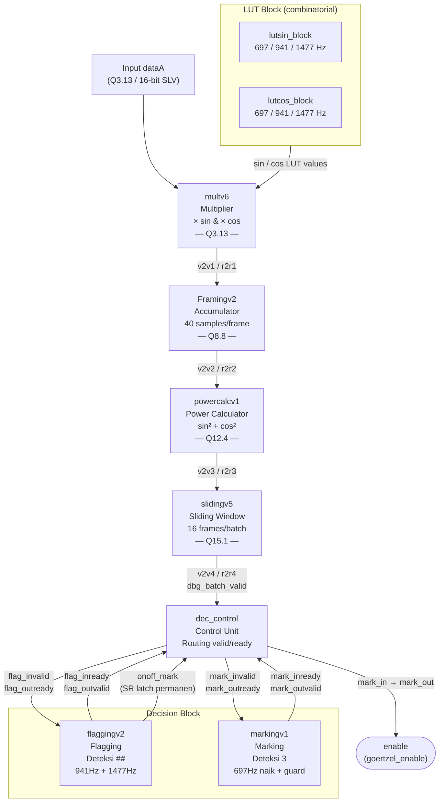

# Frame Synchronization v3 — RTL Documentation

Modul ini mengimplementasikan **Frame Synchronization** untuk mendeteksi sync point 4-simbol DTMF **`##3#`** pada sinyal audio. Output utamanya adalah sinyal `enable` yang mengaktifkan modul Goertzel (DTMF Receiver) untuk mendekode payload/data DTMF.

---

## Daftar File

| File | Tipe | Deskripsi |
|---|---|---|
| `toplevelv1.vhd` | Top-level (untuk testbench) | Instansiasi semua komponen dan digunakan oleh `toplevel_tb1/tb2` |
| `toplevel_iq.vhd` | Top-level (alternatif) | Versi alternatif top-level dengan interface `std_logic_vector` pada input |
| `dec_control.vhd` | Control unit | Mux valid/ready: routing data ke `flagging` atau `marking` |
| `flaggingv2.vhd` | Decision — Flagging | Deteksi dua simbol `#` berurutan (941 Hz + 1477 Hz) |
| `markingv1.vhd` | Decision — Marking | Deteksi simbol `3` (697 Hz naik + memastikan 697 Hz dan 1477 Hz paling dominan) |
| `slidingv5.vhd` | Sliding Window | Akumulasi nilai korelasi per batch (16 frame) |
| `powercalcv1.vhd` | Power Calculator | Hitung `sin² + cos²` dari akumulasi |
| `Framingv2.vhd` | Framing / Accumulator | Akumulasi sample per frame (40 sample) |
| `multv6.vhd` | Multiplier | Perkalian input dengan LUT sin/cos per frekuensi |
| `lutsin_block.vhd` | LUT Sin | Tabel referensi sinus (697, 941, 1477 Hz) |
| `lutcos_block.vhd` | LUT Cos | Tabel referensi kosinus (697, 941, 1477 Hz) |
| `toplevel_tb1.vhd` | Testbench | Testbench minimal (input: `dtmf_signal.txt`) |
| `toplevel_tb2.vhd` | Testbench | Testbench lengkap dengan monitor batch (input: `dtmf_signal_v2.txt`) |

---

## Arsitektur Pipeline

Setiap komponen berkomunikasi menggunakan **valid/ready handshake**. Sinyal `vNvM` dan `rNrM` merupakan koneksi antar stage:



### Parameter Fixed-Point

| Stage | Format | VHDL Range |
|---|---|---|
| Input (`dataA`) | Q3.13 | `SFIXED(2 downto -13)` |
| Multiplier output | Q3.13 | `SFIXED(2 downto -13)` |
| Accumulator output | Q8.8 | `SFIXED(7 downto -8)` |
| Power output | Q12.4 | `SFIXED(11 downto -4)` |
| Batch sum output | Q15.1 | `SFIXED(14 downto -1)` |

---

## Penjelasan Sinyal Handshake

| Sinyal | Arah | Makna |
|---|---|---|
| `v2v1` | `multv6 → Framingv2` | Output multiplier valid |
| `v2v2` | `Framingv2 → powercalc` | Output akumulasi valid |
| `v2v3` | `powercalc → slidingv5` | Output power valid |
| `v2v4` | `slidingv5 → dec_control` | **Batch baru siap** (≡ `dbg_batch_valid`) |
| `rNrM` | arah balik | Backpressure (downstream siap) |

`v2v4` (alias `dbg_batch_valid`) berarti **satu sliding window batch telah selesai dihitung**, setara dengan satu iterasi `slide_i` pada MATLAB `sliding.m`.

---

## Perubahan Modul

Perubahan berikut dilakukan untuk menyesuaikan logika RTL dengan referensi MATLAB `exp 1.7 fixed point v6`.

Referensi MATLAB: `MATLAB/Frame Synchronization/exp 1.7 fixed point v6/`

---

### Revisi `flaggingv2.vhd`

**Referensi MATLAB:** `flagging.m`

**Tujuan:** Deteksi dua simbol `#` berurutan dengan cara membandingkan nilai batch saat ini dengan nilai 32-batch lalu. Jika keduanya (941 Hz dan 1477 Hz) masing-masing memenuhi threshold ≥ 5 kali berturut-turut, flag dikonfirmasi dan `onoff_mark` di-assert.

#### Perubahan dari versi sebelumnya

| Aspek | Sebelum | Sesudah |
|---|---|---|
| **Counter** | 1 counter gabungan — naik hanya jika 941 Hz **DAN** 1477 Hz memenuhi syarat **secara bersamaan** | 2 counter **independen**: `count_941` dan `count_1477` — masing-masing naik/reset sendiri |
| **Reset counter** | Reset keduanya sekaligus jika salah satu gagal | Hanya counter yang gagal yang di-reset; yang lain tetap |
| **Circular buffer** | 25 slot (delay ~24 batch) | **33 slot** (delay 32 batch — sesuai MATLAB `slide_i - 32`) |
| **SR latch per frekuensi** | Tidak ada | `detect_941` dan `detect_1477`: latch permanen, hanya bisa `0→1` |
| **Threshold RTL** | `counter >= 5` (checks nilai lama sebelum increment) | `count >= 4` — kompensasi 1-cycle clocked delay; setara MATLAB `count >= 5` setelah increment |
| **`onoff_mark`** | Bisa berfluktuasi (di-set lalu counter di-reset) | **SR latch permanen**: sekali `'1'`, tidak pernah kembali ke `'0'` kecuali reset global |

#### Alur logika (sesuai MATLAB `flagging.m`)

```
Setiap batch baru masuk (full = '1'):

  941 Hz:
    if curr_941 >= 3 * prev_941_32batches_ago:
        count_941 = min(count_941 + 1, 5)
    else:
        count_941 = 0
    if count_941 >= 4:   ← RTL threshold (≡ MATLAB >= 5 setelah increment)
        detect_941 = '1' (latch)

  1477 Hz: (sama, independen)
    ...
    if count_1477 >= 4:
        detect_1477 = '1' (latch)

  Konfirmasi:
    if detect_941 = '1' AND detect_1477 = '1':
        onoff_mark = '1'  ← permanen, tidak pernah reset
```

---

### Revisi `markingv1.vhd`

**Referensi MATLAB:** `marking.m`

**Tujuan:** Setelah flagging mengaktifkan modul ini (via `dec_control`), deteksi simbol `3` menggunakan **dua kondisi sekuensial**.

#### Perubahan dari versi sebelumnya

| Aspek | Sebelum | Sesudah |
|---|---|---|
| **Port input** | Hanya `in_697` | `in_697` + **`in_941`** (baru) + **`in_1477`** (baru) |
| **Kondisi deteksi** | Mencari nilai maksimum `max697` — logika tidak sesuai MATLAB | Dua kondisi sekuensial sesuai `marking.m` |
| **Kondisi 1** | `max697 > in_697` (mencari puncak) | `curr_697 > prev_697` (697 Hz sedang **naik**) |
| **Kondisi 2 (guard)** | Tidak ada | `curr_697 > curr_941 AND curr_1477 > curr_941` (697 Hz **dominan** atas 941 Hz) |
| **Counter** | Counter tidak relevan (berbasis 5 iterasi) | Dihapus |
| **`enable`** | Latch tidak reliable | SR latch permanen via `enable_i` internal |

#### Alur logika (sesuai MATLAB `marking.m`)

```
Setiap batch masuk (setelah flagging aktif):

  KONDISI 1: Apakah 697 Hz sedang naik?
    if curr_697 > prev_697:

      KONDISI 2 (guard): Apakah 697 Hz dominan di atas 941 Hz?
        if curr_697 > curr_941 AND curr_1477 > curr_941:
          enable = '1'  ← permanen (goertzel_enable)

  prev_697 ← curr_697  (update untuk batch berikutnya)
```

Kondisi guard memastikan ini benar-benar simbol `3` (697+1477 Hz) dan bukan noise atau overlap dengan simbol `#` (941+1477 Hz).

---

### Revisi `toplevelv1.vhd`

**Perubahan:** Sinkronisasi dengan interface baru `markingv1` (penambahan port `in_941` dan `in_1477`).

1. **Component declaration** `markingv1`: tambah `in_941` dan `in_1477`
2. **Port map** `mark_unit`: hubungkan `sum941 → in_941` dan `sum1477 → in_1477`

---

### Revisi `toplevel_iq.vhd`

Perubahan identik: update component declaration dan port map untuk `markingv1`.

---

## Cara Menjalankan Testbench (ModelSim)

### Compile order

```tcl
vcom lutsin_block.vhd
vcom lutcos_block.vhd
vcom multv6.vhd
vcom Framingv2.vhd
vcom powercalcv1.vhd
vcom slidingv5.vhd
vcom flaggingv2.vhd
vcom markingv1.vhd
vcom dec_control.vhd
vcom toplevelv1.vhd
vcom toplevel_tb2.vhd
```
atau jalankan **"Compile All"** pada **ModelSim**

### Simulasi
```tcl
vsim toplevel_tb2
run -all
```
atau jalankan **"run -all"** pada **ModelSim**

### Output yang diharapkan (jika logika benar)
Bisa menjalankan *command* `do wave_delay14batch.do`pada **Transcript/Console** dari **ModelSim** 
```
[Batch #N] sum697=...  sum941=...  sum1477=...  -> [941+1477 dominant = '#']
...
[Batch #M] sum697=...  sum941=...  sum1477=...  -> [697+1477 dominant = '3']
>>> ENABLE ASSERTED - Frame sync point detected! <<<
...
=== Simulation Complete ===
Enable (detection) = 1
```

### Checklist verifikasi

- [ ] `onoff_mark` assert `'1'` setelah ≥ 5 batch berturut-turut memenuhi threshold 941 Hz DAN ≥5 batch berturut-turut memenuhi threshold 1477 Hz (secara independen)
- [ ] `enable` tidak false-trigger saat hanya simbol `#` yang dominan (941+1477 tanpa 697 naik)
- [ ] `enable` assert `'1'` saat 697 Hz naik (sehingga melebihi 941 Hz)dan 1477 Hz juga di atas 941 Hz
- [ ] `enable` tetap `'1'` secara permanen setelah pertama kali assert (SR latch)
- [ ] `onoff_mark` tetap `'1'` secara permanen setelah flagging dikonfirmasi

---

## Referensi

- MATLAB Golden Model: `MATLAB/Frame Synchronization/exp 1.7 fixed point v6/`
  - `flagging.m` — referensi untuk `flaggingv2.vhd`
  - `marking.m` — referensi untuk `markingv1.vhd`
  - `frame_sync.m` — alur top-level (Steps 1–6)
  - `sliding.m` — referensi untuk `slidingv5.vhd`
- Parameter simulasi: Fs = 32 kHz, frame_size = 40, batch_size = 16
- Format fixed-point utama: Q3.13 (input) → Q15.1 (batch sum output)
