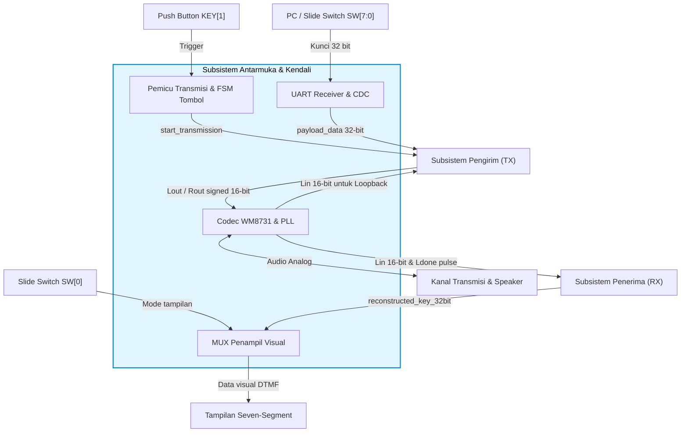
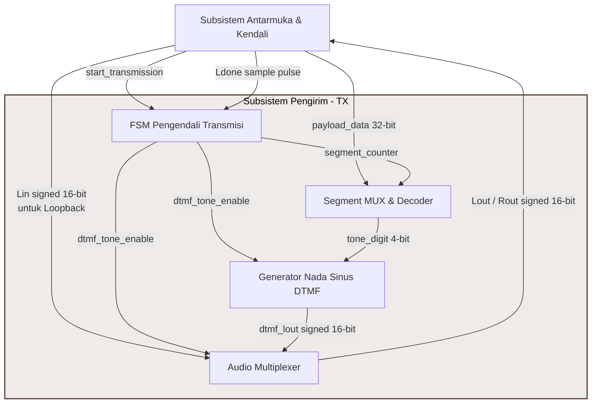

# BAB 3: RANCANGAN SISTEM

Bab ini menjelaskan rancangan arsitektur sistem secara menyeluruh (*top-level*) menggunakan dekomposisi hierarkis, diikuti dengan perancangan rinci subsistem antarmuka dan kendali, subsistem pengirim (TX), serta subsistem penerima (RX).

---

## 3.1. Arsitektur Top-Level

Arsitektur sistem dirancang dengan pendekatan bertingkat (Level 0 dan Level 1) untuk memberikan pemahaman makro sebelum masuk ke koneksi fungsional subsistem.

### 3.1.1. Diagram Blok Level 0 (Diagram Konteks)
Diagram Blok Level 0 memperlihatkan batas sistem (*system boundary*) serta interaksi antara sistem utama *Voice-Band Modem 32-bit* dengan entitas fisik eksternal pada board DE10-Standard. Aliran data dan sinyal pada tingkat konteks ini didefinisikan pada Tabel 3.1:

#### Tabel 3.1. Hubungan Aliran Data dan Sinyal pada Diagram Blok Level 0
| Entitas Eksternal | Sinyal / Data | Tipe Sinyal | Arah Aliran | Deskripsi Fungsi |
| :--- | :--- | :--- | :---: | :--- |
| **PC / Slide Switch SW[7:0]** | Kunci 32-bit | Sinyal Digital | Input | Menyediakan payload kunci digital yang akan dimodulasi dan ditransmisikan oleh pengirim. |
| **Push Button KEY[1]** | Trigger | Sinyal Digital | Input | Sinyal pemicu aktif-rendah (*falling-edge*) untuk memulai sekuens transmisi (*blast*). |
| **Slide Switch SW[0]** | Mode tampilan | Sinyal Digital | Input | Mengontrol pembagian visualisasi kunci (LSB vs MSB) pada display Seven-Segment. |
| **Tampilan Seven-Segment** | Data visual DTMF | Sinyal Umpan Balik | Output | Menampilkan kunci 32-bit hasil rekonstruksi demodulator penerima. |
| **Kanal Transmisi & Speaker** | Nada DTMF kontinu | Sinyal Analog (Audio) | Output | Menyalurkan sinyal sinusoidal hasil modulasi DTMF ke media fisik atau speaker laboratorium. |

---

### 3.1.2. Diagram Blok Level 1 (Dekomposisi Subsistem Makro)
Pada level ini, blok diagram didekomposisi menjadi tiga subsistem utama: **Subsistem Antarmuka & Kendali**, **Subsistem Pengirim (TX)**, dan **Subsistem Penerima (RX)**. Hubungan antarmuka dan interaksi antar-subsistem tersebut ditunjukkan pada diagram berikut:

```mermaid
graph TD
    %% Entitas Eksternal (Kotak Putih/Standard)
    PC_SW["PC / Slide Switch SW[7:0]"]
    PB_KEY["Push Button KEY[1]"]
    SW_0["Slide Switch SW[0]"]
    SEV_SEG["Tampilan Seven-Segment"]
    CH_SPK["Kanal Transmisi & Speaker"]

    %% Subsistem Utama (Kotak rounded grey)
    subgraph Sistem Utama [Voice-Band Modem 32-bit]
        style IF_CTRL fill:#e1f5fe,stroke:#0288d1,stroke-width:2px,color:#000
        style TX_SUB fill:#efebe9,stroke:#5d4037,stroke-width:2px,color:#000
        style RX_SUB fill:#e8f5e9,stroke:#2e7d32,stroke-width:2px,color:#000
        
        IF_CTRL["Subsistem Antarmuka & Kendali"]
        TX_SUB["Subsistem Pengirim (TX)"]
        RX_SUB["Subsistem Penerima (RX)"]
    end

    %% Koneksi Entitas Eksternal ke Antarmuka & Kendali
    PC_SW -->|Kunci 32 bit (Digital)| IF_CTRL
    PB_KEY -->|Trigger (Digital)| IF_CTRL
    SW_0 -->|Mode tampilan (Digital)| IF_CTRL
    IF_CTRL -->|Data visual DTMF (Feedback)| SEV_SEG
    IF_CTRL -->|Nada DTMF kontinu (Analog Audio)| CH_SPK
    CH_SPK -->|Sinyal analog masuk (Analog Audio)| IF_CTRL

    %% Koneksi Internal Antar-Subsistem
    IF_CTRL -->|start_transmission| TX_SUB
    IF_CTRL -->|payload_data 32-bit| TX_SUB
    IF_CTRL -->|Lin signed 16-bit \n untuk Loopback| TX_SUB
    TX_SUB -->|Lout / Rout signed 16-bit| IF_CTRL

    %% Koneksi Antarmuka ke Penerima (RX)
    IF_CTRL -->|Lin signed 16-bit \n & Ldone pulse| RX_SUB
    RX_SUB -->|reconstructed_key_32bit| IF_CTRL
```

Penjelasan aliran sinyal dan data antar-subsistem tingkat makro dirangkum pada Tabel 3.2:

#### Tabel 3.2. Aliran Sinyal dan Data Antar-Subsistem Makro (Level 1)
| Pengirim Sinyal | Penerima Sinyal | Nama Sinyal / Data | Tipe Data | Deskripsi Fungsi |
| :--- | :--- | :--- | :---: | :--- |
| **Subsistem Antarmuka & Kendali** | **Subsistem Pengirim (TX)** | `start_transmission` | Sinyal Kontrol (1-bit) | Sinyal pemicu transmisi DTMF kontinu (hasil OR UART dan tombol). |
| | | `payload_data` | Data Digital (32-bit) | Kunci digital 32-bit yang akan dikirim (diperoleh dari UART/sakelar). |
| | | `Lin` | Sinyal Digital (16-bit) | Sampel audio ADC masukan bersih untuk disalurkan saat transmisi idle. |
| | **Subsistem Penerima (RX)** | `Lin` | Sinyal Digital (16-bit) | Sampel audio ADC masukan bersih untuk diproses detektor korelasi & filter. |
| | | `Ldone` | Sinyal Jam (1-bit) | Denyut penanda sampel audio baru siap dibaca dari ADC ($32\text{ kHz}$). |
| **Subsistem Pengirim (TX)** | **Subsistem Antarmuka & Kendali** | `Lout` / `Rout` | Sinyal Digital (16-bit) | Audio digital akhir (DTMF aktif atau loopback passthrough Lin/Rin). |
| **Subsistem Penerima (RX)** | **Subsistem Antarmuka & Kendali** | `reconstructed_key_32bit` | Data Digital (32-bit) | Hasil rekonstruksi kunci 32-bit penerima untuk ditampilkan pada segment. |

---

### 3.1.3. Prosedur Penyusunan dan Penggambaran Diagram Blok Level 1
Penyusunan Diagram Blok Level 1 dilakukan secara sistematis melalui metodologi dekomposisi fungsional berikut:
1.  **Identifikasi Batasan Sistem (*System Boundary*):** Menetapkan batas fisik antara logika internal FPGA dengan perangkat keras eksternal. Pin I/O fisik (`KEY`, `SW`, `UART_RXD`, `HEX`, dan audio codec) ditempatkan di luar batas sistem sebagai entitas eksternal.
2.  **Dekomposisi Fungsional Makro:** Mengelompokkan seluruh kode modul VHDL internal menjadi tiga kelompok fungsional utama berdasarkan kesamaan tugas (Antarmuka & Kendali, Pengirim/TX, Penerima/RX).
3.  **Pemetaan Aliran Sinyal Interkoneksi:** Menelusuri port-port pada kode top-level untuk memetakan jalur kabel (*wire*) dan bus data antar-subsistem secara konsisten.
4.  **Visualisasi Grafis:** Merepresentasikan subsistem utama sebagai blok persegi panjang bersudut tumpul di bagian tengah, entitas eksternal di sisi terluar, serta garis panah berarah berlabel sebagai representasi sinyal logika VHDL.

---

## 3.2. Rancangan Antarmuka & Kendali

Subsistem Antarmuka & Kendali menjembatani pin fisik board DE10-Standard dengan logika pemrosesan modem di dalam FPGA. Subsistem ini menangani clocking, konfigurasi I2C, konversi ADC/DAC serial, penerima UART, penanganan Clock-Domain Crossing (CDC), logika pemicu transmisi, serta visualisasi Seven-Segment. Rincian hubungan blok internal Subsistem Antarmuka & Kendali disajikan pada diagram berikut:



### 3.2.2. Konfigurasi Codec WM8731 & PLL
Sistem beroperasi menggunakan clock master audio $18,432\text{ MHz}$ (`AUD_XCK`) yang disintesis dari clock osilator $50\text{ MHz}$ (`CLOCK_50`) menggunakan IP *Altera PLL* (audiopll). Frekuensi master clock ini dipilih karena habis dibagi untuk menghasilkan frekuensi sampling ($f_s$) tepat $32\text{ kHz}$.
Konfigurasi chip Codec WM8731 dilakukan oleh pengendali I2C ([Audio_interface.vhd](file:///d:/Users/Rafi%20Ananta%20Alden/Documents/Kuliah/Semester%208/EL4064/Enkripsi-Suara-FPGA/Demo/Top-Level/hdl/Audio_interface.vhd)) saat inisialisasi boot untuk mengatur volume, format data audio serial ($16\text{-bit}$ I2S), laju sampling, dan mode operasi master-slave.

### 3.2.3. UART Receiver & Clock-Domain Crossing (CDC)
Penerimaan kunci digital secara dinamis dari PC menggunakan modul penerima UART ([uart_rx.vhd](file:///d:/Users/Rafi%20Ananta%20Alden/Documents/Kuliah/Semester%208/EL4064/Enkripsi-Suara-FPGA/Demo/Top-Level/hdl/util/uart_rx.vhd)) dengan baudrate 115200 bps. Karena UART beroperasi pada clock domain stabil $50\text{ MHz}$ (`CLOCK_50`) sedangkan kendali modem utama beroperasi pada domain `AUD_XCK`, maka diterapkan sirkuit *2-FF Synchronizer* untuk memindahkan sinyal validitas UART (`uart_rx_valid`) guna mencegah metastabilitas. Sinyal byte data yang masuk (`uart_rx_data`) ditangkap pada register penampung (`uart_data_latch`) saat data valid.

### 3.2.4. Logika Pemicu Transmisi & FSM Tombol
Sinyal pemicu transmisi (`start_transmission`) diproduksi secara paralel oleh dua mekanisme input:
1.  **Pemicu Software (UART):** Sebuah FSM kecil mendeteksi kedatangan karakter *Line Feed* (`\n` / `0x0A`). Byte data sebelum karakter pembatas digeser ke dalam register kunci UART (`uart_key_reg`). Kedatangan karakter `0x0A` menyalakan pulsa pemicu `uart_trigger` selama satu siklus clock.
2.  **Pemicu Hardware (KEY):** Penekanan tombol fisik `KEY(1)` dikelola oleh FSM pengendali tombol dengan status `WAIT_FOR_PRESS`, `WAIT_FOR_RELEASE`, dan `RELEASE_STATE` untuk menghasilkan pulsa sinyal `command` saat tombol dilepas (*falling-edge*).

Kedua sinyal pemicu digabungkan secara kombinasional menggunakan gerbang logika `OR` untuk memicu pemancaran DTMF.

### 3.2.5. Multiplexing Penampil Visual
Kunci 32-bit yang diterima (`reconstructed_key_32bit`) divisualisasikan pada 6 display Seven-Segment. Karena keterbatasan fisik display, slide switch `SW(0)` digunakan sebagai penentu halaman tampilan (*bank-switching*):
*   Jika `SW(0) = '0'` (LSB Mode): 24-bit data terbawah (6 digit hex) dikonversi ke kode Seven-Segment active-low dan ditampilkan pada `HEX5` s.d. `HEX0`.
*   Jika `SW(0) = '1'` (MSB Mode): 8-bit data teratas (2 digit hex) ditampilkan pada `HEX5` dan `HEX4`. Display `HEX3` hingga `HEX0` dipaksa menampilkan karakter strip (`-`) dengan memicu nilai active-low `"0111111"`.

---

## 3.3. Rancangan Sisi Pengirim (Transmitter - TX)

Subsistem pengirim bertugas merangkaikan simbol paket DTMF, mengatur pewaktuan transmisi kontinu, memodulasi nilai 4-bit menjadi frekuensi nada sinusoidal, dan mengisolasi derau mikrofon. Rincian hubungan blok internal Subsistem Pengirim (TX) disajikan pada diagram berikut:



### 3.3.1. FSM Pengendali Transmisi (Transmitter FSM)
FSM Pengirim mengontrol transisi status pengiriman 12 simbol yang membentuk satu paket bingkai transmisi. FSM beroperasi sinkron pada clock `AUD_XCK` dan dikendalikan oleh denyut `Ldone` ($32\text{ kHz}$). 
*   Status berpindah dari `IDLE` ke `TRANSMIT` saat `start_transmission = '1'`.
*   Saat berada di status `TRANSMIT`, modul penyandi nada diaktifkan (`dtmf_tone_enable = '1'`).
*   Pencacah sampel (`sample_counter`) menghitung denyut `Ldone` hingga mencapai 640 sampel ($20\text{ ms}$). Begitu tercapai, `sample_counter` kembali ke 0, dan pencacah segmen (`segment_counter`) ditambahkan 1.
*   Transmisi berjalan kontinu tanpa jeda diam (*continuous handshake blast*). Ketika `segment_counter` mencapai 12 (simbol ke-11 selesai dipancarkan), FSM kembali ke status `IDLE` dan mematikan pemancar.

### 3.3.2. Segment Multiplexer & Decoder Simbol
Setiap penambahan `segment_counter` dari nilai 0 hingga 11 akan memetakan simbol DTMF yang dikirim sesuai protokol pembingkaian:
*   Jika `segment_counter` bernilai `0`, `1`, atau `3`, simbol dikunci pada nilai `0xF` (merepresentasikan karakter DTMF `#`).
*   Jika `segment_counter` bernilai `2`, simbol dikunci pada nilai `0x3` (merepresentasikan karakter DTMF `3`).
*   Jika `segment_counter` bernilai `4` s.d. `11`, nilai yang dikirim adalah payload kunci 32-bit yang dipecah per 4-bit (`current_4bit_segment`) mulai dari segmen MSB hingga LSB.

### 3.3.3. Generator Nada Sinus DTMF
Pembangkitan DTMF murni dikerjakan oleh entitas [generate_dtmf_signed.vhd](file:///d:/Users/Rafi%20Ananta%20Alden/Documents/Kuliah/Semester%208/EL4064/Enkripsi-Suara-FPGA/Demo/Top-Level/hdl/sender_hdl/generate_dtmf_signed.vhd) yang menggabungkan dua osilator NCO [sine_gen_signed.vhd](file:///d:/Users/Rafi%20Ananta%20Alden/Documents/Kuliah/Semester%208/EL4064/Enkripsi-Suara-FPGA/Demo/Top-Level/hdl/sender_hdl/sine_gen_signed.vhd). Simbol 4-bit diterjemahkan menjadi nilai kenaikan fase (*phase increment*) 32-bit berdasarkan frekuensi spesifik menggunakan persamaan:

$$\Delta \theta = \frac{f \times 2^{32}}{f_s}$$

Menggunakan frekuensi sampling $f_s = 32.000\text{ Hz}$, nilai konstanta kenaikan fase didefinisikan pada Tabel 3.3:

#### Tabel 3.3. Nilai Konstanta Phase Increment NCO ($f_s = 32\text{ kHz}$)
| Grup Frekuensi | Frekuensi ($f$) | Nilai Phase Increment ($\Delta \theta$) | Keterangan |
| :---: | :---: | :---: | :--- |
| **Low Group** | $697\text{ Hz}$ | $162.388$ | Digunakan untuk nada dasar simbol 1, 2, 3, A |
| | $770\text{ Hz}$ | $179.393$ | Digunakan untuk nada dasar simbol 4, 5, 6, B |
| | $852\text{ Hz}$ | $198.494$ | Digunakan untuk nada dasar simbol 7, 8, 9, C |
| | $941\text{ Hz}$ | $219.224$ | Digunakan untuk nada dasar simbol *, 0, #, D |
| **High Group** | $1209\text{ Hz}$ | $281.644$ | Nada grup tinggi kolom 1 |
| | $1336\text{ Hz}$ | $311.220$ | Nada grup tinggi kolom 2 |
| | $1477\text{ Hz}$ | $344.056$ | Nada grup tinggi kolom 3 |
| | $1633\text{ Hz}$ | $380.394$ | Nada grup tinggi kolom 4 (A, B, C, D) |

NCO menggunakan sirkuit akumulator fase 32-bit yang mengindeks tabel pencarian sinus 1-kuadran. Logika internal memetakan akumulator fase untuk mencerminkan kuadran (menentukan tanda pembalikan positif/negatif) dan membalik urutan indeks tabel untuk kuadran genap guna merekonstruksi gelombang sinus penuh.

---

## 3.4. Rancangan Sisi Penerima (RX)

Subsistem penerima mendeteksi paket preamble korelasi kuadratur, mengunci batas awal sampel secara berkala, melakukan komputasi spektral daya DTMF melalui bank filter Goertzel, dan mendekodekan data kunci hasil pemulihan.

### 3.4.1. Detektor Preamble Korelasi I/Q
Deteksi pola preamble `#, #, 3, #` ditangani oleh [toplevel_iq.vhd](file:///d:/Users/Rafi%20Ananta%20Alden/Documents/Kuliah/Semester%208/EL4064/Enkripsi-Suara-FPGA/Demo/Top-Level/hdl/receiver_hdl/toplevel_iq.vhd) yang terdiri dari:
1.  **Look-up Table Kuadratur:** Membangkitkan nilai sinus dan kosinus lokal untuk frekuensi deteksi $697\text{ Hz}$, $941\text{ Hz}$, dan $1477\text{ Hz}$.
2.  **Korelator Multiplier & Accumulator (MAC):** Sampel input dari ADC dikalikan dengan sinus dan kosinus lokal secara konkuren untuk memisahkan fasa *In-phase* (I) dan *Quadrature* (Q). Hasil perkalian diakumulasikan sepanjang ukuran blok korelasi.
3.  **Kalkulator Daya:** Menghitung daya korelasi total untuk setiap frekuensi:
    $$Power = I^2 + Q^2$$
4.  **Marking & Flagging:** Blok `markingv1` memantau kemunculan frekuensi dominan nada `3` ($697\text{ Hz}$ & $1477\text{ Hz}$) dengan *guard condition* (daya $697\text{ Hz}$ harus dominan melampaui $941\text{ Hz}$). Blok `flaggingv2` memantau kemunculan frekuensi dominan nada `#` ($941\text{ Hz}$ & $1477\text{ Hz}$).
5.  **Pengendali Keputusan (`dec_control`):** Menelusuri urutan deteksi. Begitu pola `#, #, 3, #` terpenuhi, unit ini mengaktifkan pulsa `enable` untuk memulai pemicuan FSM filter Goertzel pada titik ketukan awal $T=0$.

### 3.4.2. Bank Filter Goertzel DSP
Komputasi intensif deteksi frekuensi DTMF menggunakan bank filter berisi 8 modul [Goertzel.vhd](file:///d:/Users/Rafi%20Ananta%20Alden/Documents/Kuliah/Semester%208/EL4064/Enkripsi-Suara-FPGA/Demo/Top-Level/hdl/dtmf_detect_hdl/Goertzel.vhd) paralel. Setiap filter menghitung persamaan rekursif:
$$Q_0[n] = x[n] + \text{COEFF} \cdot Q_1[n-1] - Q_2[n-2]$$
Nilai koefisien komputasi $\text{COEFF} = 2\cos(2\pi f / f_s)$ diatur menggunakan tipe fixed-point `sfixed` (Q2.14) dan didefinisikan pada Tabel 3.4:

#### Tabel 3.4. Koefisien Desimal & Fixed-Point Filter Goertzel ($f_s = 32\text{ kHz}$)
| Frekuensi ($f$) | Koefisien Desimal | Koefisien Fixed-Point (Q2.14) |
| :---: | :---: | :---: |
| $697\text{ Hz}$ | $1.981299751034064$ | `16"b0111111011001000"` (Nilai: $1,98096$) |
| $770\text{ Hz}$ | $1.977185350114547$ | `16"b0111111010001001"` (Nilai: $1,97711$) |
| $852\text{ Hz}$ | $1.972079326472499$ | `16"b0111111000110110"` (Nilai: $1,97205$) |
| $941\text{ Hz}$ | $1.965958931999434$ | `16"b0111110111010000"` (Nilai: $1,96582$) |
| $1209\text{ Hz}$ | $1.943911740684265$ | `16"b0111110001101000"` (Nilai: $1,94385$) |
| $1336\text{ Hz}$ | $1.931580353106243$ | `16"b0111101110011110"` (Nilai: $1,93152$) |
| $1477\text{ Hz}$ | $1.916483020260862$ | `16"b0111101010101000"` (Nilai: $1,91650$) |
| $1633\text{ Hz}$ | $1.898236173491410$ | `16"b0111100101111101"` (Nilai: $1,89825$) |

Setelah pemrosesan sampel mencapai ukuran blok $N=640$ (diatur oleh counter internal), FSM filter berpindah ke tahap komputasi non-rekursif untuk mendapatkan nilai daya akhir:
$$\text{Power} = Q_1^2 + Q_2^2 - \text{COEFF} \cdot Q_1 \cdot Q_2$$

Komputasi ini dilakukan secara sekuensial melalui 12 status FSM (`IDLE` $\rightarrow$ `COMPUTE_FILTER_1..3` $\rightarrow$ `STORE_TO_Q0` $\rightarrow$ `UPDATE` $\rightarrow$ `COMPUTE_POWER_1..5` $\rightarrow$ `OUTPUT`) untuk menghemat penggunaan unit perkalian DSP silikon pada FPGA.

### 3.4.3. Latching Index & Demodulator Keputusan
*   **Pencuplikan Berkala (Latching):** Setelah pendeteksi preamble mengunci batas awal paket, subsistem penerima menyalakan *Periodic Counter*. Pembacaan status deteksi tidak dilakukan di awal transisi nada demi mencegah kegagalan baca akibat gangguan transien. Pembacaan latching dipaksa tepat di tengah jendela simbol (sampel ke-320 dari total 640 sampel simbol) dengan formula:
    $$\text{index} = \text{sync\_lock\_index} + 320 + (N \times 640) \quad \text{untuk } N = 0 \text{ s.d. } 7$$
*   **Dekoder Keputusan:** Nilai daya dari ke-8 modul Goertzel dimasukkan ke [top_dtmfencode.vhd](file:///d:/Users/Rafi%20Ananta%20Alden/Documents/Kuliah/Semester%208/EL4064/Enkripsi-Suara-FPGA/Demo/Top-Level/hdl/dtmf_detect_hdl/top_dtmfencode.vhd). Komparator internal mencari indeks daya maksimum pada grup frekuensi rendah (maksimum dari 697, 770, 852, 941 Hz) dan grup tinggi (maksimum dari 1209, 1336, 1477, 1633 Hz). Pasangan indeks terpilih dipetakan kembali ke nilai simbol heksadesimal 4-bit (`dtmf_code_4bit`).
*   **Shift & Add Register:** Setiap kali pulsa `dtmf_code_valid` menyala (tercuplik di sampel tengah), nilai heksadesimal 4-bit digeser masuk ke register penampung kunci 32-bit ([shift_add.vhd](file:///d:/Users/Rafi%20Ananta%20Alden/Documents/Kuliah/Semester%208/EL4064/Enkripsi-Suara-FPGA/Demo/Top-Level/hdl/dtmf_detect_hdl/shift_add.vhd)) dari LSB ke MSB hingga kunci 32-bit utuh pulih kembali.