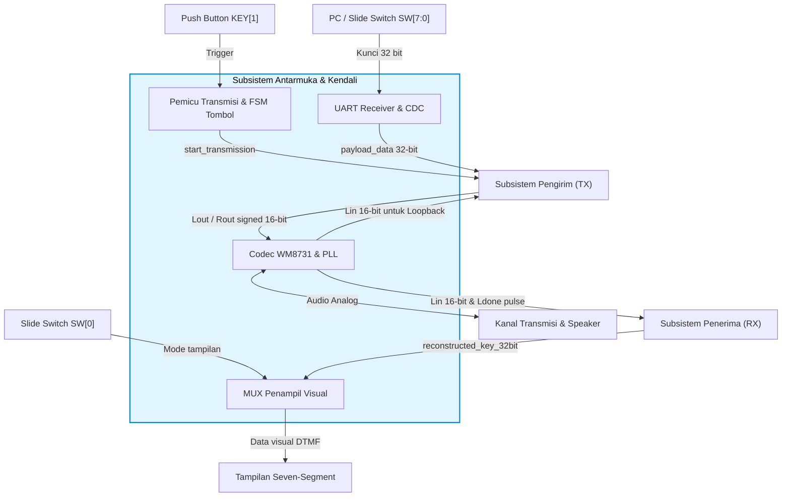
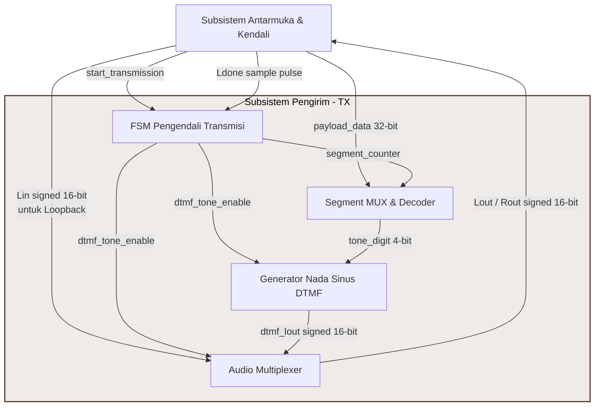
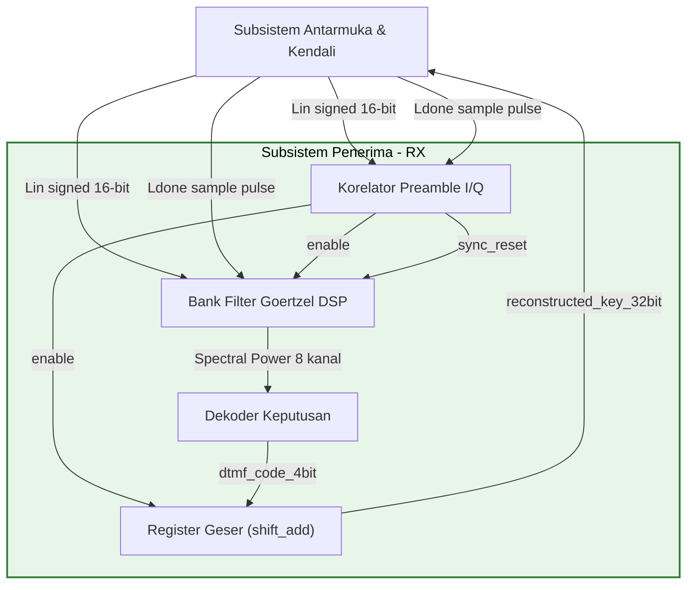

# BAB 3: RANCANGAN SISTEM

Bab ini menjelaskan rancangan arsitektur sistem secara menyeluruh (*top-level*) menggunakan dekomposisi hierarkis, diikuti dengan perancangan rinci subsistem antarmuka dan kendali, subsistem pengirim (TX), serta subsistem penerima (RX).

---

## 3.1. Arsitektur Top-Level

Arsitektur sistem dirancang dengan pendekatan bertingkat (Level 0 dan Level 1) untuk memberikan pemahaman makro sebelum masuk ke koneksi fungsional subsistem.

### 3.1.1. Diagram Blok Level 0 (Diagram Konteks)
Diagram Blok Level 0 memperlihatkan batas sistem (*system boundary*) serta interaksi antara sistem utama *Voice-Band Modem 32-bit* dengan entitas fisik eksternal pada board DE10-Standard. Aliran data dan sinyal pada tingkat konteks ini didefinisikan pada Tabel 3.1:

#### Tabel 3.1. Hubungan Aliran Data dan Sinyal pada Diagram Blok Level 0
| Entitas Eksternal | Sinyal / Data | Tipe Sinyal | Arah Aliran | Deskripsi Fungsi |
| :--- | :--- | :--- | :---: | :--- |
| **PC / Slide Switch SW[7:0]** | Kunci 32-bit | Sinyal Digital | Input | Menyediakan payload kunci digital yang akan dimodulasi dan ditransmisikan oleh pengirim. |
| **Push Button KEY[1]** | Trigger | Sinyal Digital | Input | Sinyal pemicu aktif-rendah (*falling-edge*) untuk memulai sekuens transmisi (*blast*). |
| **Slide Switch SW[0]** | Mode tampilan | Sinyal Digital | Input | Mengontrol pembagian visualisasi kunci (LSB vs MSB) pada display Seven-Segment. |
| **Tampilan Seven-Segment** | Data visual DTMF | Sinyal Umpan Balik | Output | Menampilkan kunci 32-bit hasil rekonstruksi demodulator penerima. |
| **Kanal Transmisi & Speaker** | Nada DTMF kontinu | Sinyal Analog (Audio) | Output | Menyalurkan sinyal sinusoidal hasil modulasi DTMF ke media fisik atau speaker laboratorium. |

---

### 3.1.2. Diagram Blok Level 1 (Dekomposisi Subsistem Makro)
Pada level ini, blok diagram didekomposisi menjadi tiga subsistem utama: **Subsistem Antarmuka & Kendali**, **Subsistem Pengirim (TX)**, dan **Subsistem Penerima (RX)**. Hubungan antarmuka dan interaksi antar-subsistem tersebut ditunjukkan pada diagram berikut:

```mermaid
graph TD
    %% Entitas Eksternal (Kotak Putih/Standard)
    PC_SW["PC / Slide Switch SW[7:0]"]
    PB_KEY["Push Button KEY[1]"]
    SW_0["Slide Switch SW[0]"]
    SEV_SEG["Tampilan Seven-Segment"]
    CH_SPK["Kanal Transmisi & Speaker"]

    %% Subsistem Utama (Kotak rounded grey)
    subgraph Sistem Utama [Voice-Band Modem 32-bit]
        style IF_CTRL fill:#e1f5fe,stroke:#0288d1,stroke-width:2px,color:#000
        style TX_SUB fill:#efebe9,stroke:#5d4037,stroke-width:2px,color:#000
        style RX_SUB fill:#e8f5e9,stroke:#2e7d32,stroke-width:2px,color:#000
        
        IF_CTRL["Subsistem Antarmuka & Kendali"]
        TX_SUB["Subsistem Pengirim (TX)"]
        RX_SUB["Subsistem Penerima (RX)"]
    end

    %% Koneksi Entitas Eksternal ke Antarmuka & Kendali
    PC_SW -->|Kunci 32 bit (Digital)| IF_CTRL
    PB_KEY -->|Trigger (Digital)| IF_CTRL
    SW_0 -->|Mode tampilan (Digital)| IF_CTRL
    IF_CTRL -->|Data visual DTMF (Feedback)| SEV_SEG
    IF_CTRL -->|Nada DTMF kontinu (Analog Audio)| CH_SPK
    CH_SPK -->|Sinyal analog masuk (Analog Audio)| IF_CTRL

    %% Koneksi Internal Antar-Subsistem
    IF_CTRL -->|start_transmission| TX_SUB
    IF_CTRL -->|payload_data 32-bit| TX_SUB
    IF_CTRL -->|Lin signed 16-bit \n untuk Loopback| TX_SUB
    TX_SUB -->|Lout / Rout signed 16-bit| IF_CTRL

    %% Koneksi Antarmuka ke Penerima (RX)
    IF_CTRL -->|Lin signed 16-bit \n & Ldone pulse| RX_SUB
    RX_SUB -->|reconstructed_key_32bit| IF_CTRL
```

Penjelasan aliran sinyal dan data antar-subsistem tingkat makro dirangkum pada Tabel 3.2:

#### Tabel 3.2. Aliran Sinyal dan Data Antar-Subsistem Makro (Level 1)
| Pengirim Sinyal | Penerima Sinyal | Nama Sinyal / Data | Tipe Data | Deskripsi Fungsi |
| :--- | :--- | :--- | :---: | :--- |
| **Subsistem Antarmuka & Kendali** | **Subsistem Pengirim (TX)** | `start_transmission` | Sinyal Kontrol (1-bit) | Sinyal pemicu transmisi DTMF kontinu (hasil OR UART dan tombol). |
| | | `payload_data` | Data Digital (32-bit) | Kunci digital 32-bit yang akan dikirim (diperoleh dari UART/sakelar). |
| | | `Lin` | Sinyal Digital (16-bit) | Sampel audio ADC masukan bersih untuk disalurkan saat transmisi idle. |
| | **Subsistem Penerima (RX)** | `Lin` | Sinyal Digital (16-bit) | Sampel audio ADC masukan bersih untuk diproses detektor korelasi & filter. |
| | | `Ldone` | Sinyal Jam (1-bit) | Denyut penanda sampel audio baru siap dibaca dari ADC ($32\text{ kHz}$). |
| **Subsistem Pengirim (TX)** | **Subsistem Antarmuka & Kendali** | `Lout` / `Rout` | Sinyal Digital (16-bit) | Audio digital akhir (DTMF aktif atau loopback passthrough Lin/Rin). |
| **Subsistem Penerima (RX)** | **Subsistem Antarmuka & Kendali** | `reconstructed_key_32bit` | Data Digital (32-bit) | Hasil rekonstruksi kunci 32-bit penerima untuk ditampilkan pada segment. |

---

### 3.1.3. Prosedur Penyusunan dan Penggambaran Diagram Blok Level 1
Penyusunan Diagram Blok Level 1 dilakukan secara sistematis melalui metodologi dekomposisi fungsional berikut:
1.  **Identifikasi Batasan Sistem (*System Boundary*):** Menetapkan batas fisik antara logika internal FPGA dengan perangkat keras eksternal. Pin I/O fisik (`KEY`, `SW`, `UART_RXD`, `HEX`, dan audio codec) ditempatkan di luar batas sistem sebagai entitas eksternal.
2.  **Dekomposisi Fungsional Makro:** Mengelompokkan seluruh kode modul VHDL internal menjadi tiga kelompok fungsional utama berdasarkan kesamaan tugas (Antarmuka & Kendali, Pengirim/TX, Penerima/RX).
3.  **Pemetaan Aliran Sinyal Interkoneksi:** Menelusuri port-port pada kode top-level untuk memetakan jalur kabel (*wire*) dan bus data antar-subsistem secara konsisten.
4.  **Visualisasi Grafis:** Merepresentasikan subsistem utama sebagai blok persegi panjang bersudut tumpul di bagian tengah, entitas eksternal di sisi terluar, serta garis panah berarah berlabel sebagai representasi sinyal logika VHDL.

---

## 3.2. Rancangan Antarmuka & Kendali

Subsistem Antarmuka & Kendali menjembatani pin fisik board DE10-Standard dengan logika pemrosesan modem di dalam FPGA. Subsistem ini menangani clocking, konfigurasi I2C, konversi ADC/DAC serial, penerima UART, penanganan Clock-Domain Crossing (CDC), logika pemicu transmisi, serta visualisasi Seven-Segment. Rincian hubungan blok internal Subsistem Antarmuka & Kendali disajikan pada diagram berikut:



### 3.2.2. Manajemen Detak & Penskalaan Audio
Sistem membutuhkan sinkronisasi detak yang presisi untuk menjamin akurasi frekuensi sampling audio. Detak utama audio diturunkan dari detak sistem pusat melalui pembagi frekuensi berbasis perangkat keras untuk menghasilkan laju sampling yang stabil. Pengendalian konfigurasi codec audio dilakukan melalui bus komunikasi serial pada saat inisialisasi awal sistem untuk menetapkan parameter operasional seperti level volume suara, format pengodean data serial audio, laju pengambilan sampel, dan relasi master-slave antar-perangkat.

### 3.2.3. Antarmuka Data Digital & Penyearahan Domain Detak
Penerimaan data eksternal secara dinamis dilakukan melalui modul antarmuka komunikasi serial tak-sinkron dengan laju transfer data standar. Dikarenakan modul komunikasi serial tersebut dan unit pemrosesan modem utama bekerja pada domain detak yang berbeda, diterapkan mekanisme penyelarasan detak bertingkat (*clock-domain crossing*) untuk meniadakan risiko metastabilitas sinyal kontrol. Data byte yang diterima secara serial akan ditangkap dan disimpan sementara pada penyangga data internal begitu penanda validitas transmisi terdeteksi.

### 3.2.4. Mekanisme Pemicuan Pengiriman Data
Transmisi paket nada diaktifkan secara paralel melalui dua jalur pemicu independen:
1. **Pemicu Perangkat Lunak:** Unit logika mendeteksi kedatangan karakter pembatas baris pada aliran data komunikasi serial. Bit-bit data yang diterima sebelum pembatas baris akan dirakit menjadi sebuah kata kunci digital, dan kedatangan karakter pembatas akan memicu pulsa inisiasi pengiriman.
2. **Pemicu Perangkat Keras:** Pendeteksian penekanan tombol fisik dikelola menggunakan logika pengendali debounce tombol untuk mendeteksi tepi transisi saat tombol dilepas, menghasilkan sinyal pemicu pengiriman yang bersih dari derau mekanis.

Kedua jalur pemicuan tersebut digabungkan menggunakan logika penjumlahan Boolean untuk menginisiasi proses pemancaran nada.

### 3.2.5. Pemultipleksan Unit Visualisasi
Kunci digital hasil rekonstruksi ditampilkan pada modul penampil visual multi-digit heksadesimal. Mengingat keterbatasan jumlah digit penampil fisik dibandingkan dengan panjang kunci data enkripsi, diterapkan mekanisme pemilihan halaman tampilan (*bank-switching*) menggunakan sakelar pemilih:
* **Mode Bagian Rendah:** Menampilkan fraksi bit-bit signifikansi rendah (LSB) dari data kunci pada penampil visual.
* **Mode Bagian Tinggi:** Menampilkan fraksi bit-bit signifikansi tinggi (MSB) dari data kunci pada sebagian penampil visual, sementara digit penampil sisa dipaksa menampilkan karakter penanda kosong (strip) guna memberikan kontras visual halaman informasi yang jelas.

---

## 3.3. Rancangan Sisi Pengirim (Transmitter - TX)

Subsistem pengirim bertugas merangkaikan simbol paket DTMF, mengatur pewaktuan transmisi kontinu, memodulasi nilai 4-bit menjadi frekuensi nada sinusoidal, dan mengisolasi derau mikrofon. Rincian hubungan blok internal Subsistem Pengirim (TX) disajikan pada diagram berikut:



#### 3.3.1. Pengendali Penjadwalan Waktu Transmisi
Unit pengendali waktu transmisi mengatur siklus hidup pengiriman bingkai data yang terdiri dari sejumlah simbol serial berurutan. Unit ini bekerja secara sinkron berdasarkan laju sampel audio yang masuk.
* Status operasional berpindah dari kondisi bersiap (*idle*) ke kondisi aktif pengiriman (*transmit*) saat pemicu aktif terdeteksi.
* Selama proses pengiriman aktif, unit pensintesis nada diaktifkan secara kontinu.
* Pengendali waktu menghitung sampel masukan hingga mencapai batas durasi per simbol (20 ms). Setelah batas tercapai, penghitung sampel dikembalikan ke nol dan penunjuk indeks simbol berurutan dinaikkan untuk menunjuk segmen berikutnya.
* Pengiriman berjalan tanpa jeda untuk menjaga keharmonisan fasa sinyal. Setelah semua simbol dalam satu bingkai selesai dipancarkan, sistem secara otomatis kembali ke keadaan bersiap dan mematikan unit pensintesis nada.

### 3.3.2. Pemultipleksan Paket Bingkai Simbol
Setiap pergeseran penunjuk indeks simbol dari awal hingga akhir bingkai dipetakan secara kombinasional mengikuti tata letak protokol transmisi:
* Segmen simbol pertama, kedua, dan keempat dikunci untuk memancarkan frekuensi pembuka (preamble `#`).
* Segmen simbol ketiga memancarkan nada transisi spektral penyelarasan fasa (preamble `3`).
* Segmen simbol kelima hingga akhir secara dinamis memetakan potongan-potongan kecil dari kata kunci enkripsi 32-bit dari bit signifikansi tinggi (MSB) ke bit signifikansi rendah (LSB).

### 3.3.3. Pembangkitan Nada Spektral Berbasis Osilator Numerik
Sintesis gelombang audio dual-nada murni dikerjakan oleh unit pembangkit nada yang menggabungkan dua osilator terkontrol numerik (NCO) untuk frekuensi rendah dan tinggi. Potongan kode simbol yang masuk diterjemahkan menjadi nilai kenaikan fasa (*phase increment*) berdasarkan persamaan fasa sebagai berikut:

$$\Delta \theta = \frac{f \times 2^{32}}{f_s}$$

Berdasarkan frekuensi sampling yang ditetapkan, nilai konstanta kenaikan fasa didefinisikan pada Tabel 3.3:

#### Tabel 3.3. Nilai Konstanta Phase Increment NCO ($f_s = 32\text{ kHz}$)
| Grup Frekuensi | Frekuensi ($f$) | Nilai Phase Increment ($\Delta \theta$) | Keterangan |
| :---: | :---: | :---: | :--- |
| **Grup Rendah** | $697\text{ Hz}$ | $162.388$ | Digunakan untuk nada dasar baris ke-1 |
| | $770\text{ Hz}$ | $179.393$ | Digunakan untuk nada dasar baris ke-2 |
| | $852\text{ Hz}$ | $198.494$ | Digunakan untuk nada dasar baris ke-3 |
| | $941\text{ Hz}$ | $219.224$ | Digunakan untuk nada dasar baris ke-4 |
| **Grup Tinggi** | $1209\text{ Hz}$ | $281.644$ | Nada grup tinggi kolom ke-1 |
| | $1336\text{ Hz}$ | $311.220$ | Nada grup tinggi kolom ke-2 |
| | $1477\text{ Hz}$ | $344.056$ | Nada grup tinggi kolom ke-3 |
| | $1633\text{ Hz}$ | $380.394$ | Nada grup tinggi kolom ke-4 |

Unit pembangkitan menggunakan akumulator fasa lebar bit tinggi yang mengindeks tabel pencarian sinus satu kuadran. Logika internal memetakan akumulator fasa untuk mendeteksi kuadran aktif guna melakukan pembalikan polaritas amplitudo (positif/negatif) serta membalik arah penelusuran tabel secara simetris untuk kuadran genap demi membentuk gelombang sinus penuh yang kontinu.

---

## 3.4. Rancangan Sisi Penerima (RX)

Subsistem penerima mendeteksi paket preamble korelasi kuadratur, mengunci batas awal sampel secara berkala, melakukan komputasi spektral daya DTMF melalui bank filter Goertzel, dan mendekodekan data kunci hasil pemulihan.



### 3.4.1. Detektor Preamble Korelasi I/Q
Deteksi pola preamble `#, #, 3, #` ditangani oleh [toplevel_iq.vhd](file:///d:/Users/Rafi%20Ananta%20Alden/Documents/Kuliah/Semester%208/EL4064/Enkripsi-Suara-FPGA/Demo/Top-Level/hdl/receiver_hdl/toplevel_iq.vhd) yang terdiri dari:
1.  **Look-up Table Kuadratur:** Membangkitkan nilai sinus dan kosinus lokal untuk frekuensi deteksi $697\text{ Hz}$, $941\text{ Hz}$, dan $1477\text{ Hz}$.
2.  **Korelator Multiplier & Accumulator (MAC):** Sampel input dari ADC dikalikan dengan sinus dan kosinus lokal secara konkuren untuk memisahkan fasa *In-phase* (I) dan *Quadrature* (Q). Hasil perkalian diakumulasikan sepanjang ukuran blok korelasi.
3.  **Kalkulator Daya:** Menghitung daya korelasi total untuk setiap frekuensi:
    $$Power = I^2 + Q^2$$
4.  **Marking & Flagging:** Blok `markingv1` memantau kemunculan frekuensi dominan nada `3` ($697\text{ Hz}$ & $1477\text{ Hz}$) dengan *guard condition* (daya $697\text{ Hz}$ harus dominan melampaui $941\text{ Hz}$). Blok `flaggingv2` memantau kemunculan frekuensi dominan nada `#` ($941\text{ Hz}$ & $1477\text{ Hz}$).
5.  **Pengendali Keputusan (`dec_control`):** Menelusuri urutan deteksi. Begitu pola `#, #, 3, #` terpenuhi, unit ini mengaktifkan pulsa `enable` untuk memulai pemicuan FSM filter Goertzel pada titik ketukan awal $T=0$.

### 3.4.2. Bank Filter Goertzel DSP
Komputasi intensif deteksi frekuensi DTMF menggunakan bank filter berisi 8 modul [Goertzel.vhd](file:///d:/Users/Rafi%20Ananta%20Alden/Documents/Kuliah/Semester%208/EL4064/Enkripsi-Suara-FPGA/Demo/Top-Level/hdl/dtmf_detect_hdl/Goertzel.vhd) paralel. Setiap filter menghitung persamaan rekursif:
$$Q_0[n] = x[n] + \text{COEFF} \cdot Q_1[n-1] - Q_2[n-2]$$
Nilai koefisien komputasi $\text{COEFF} = 2\cos(2\pi f / f_s)$ diatur menggunakan tipe fixed-point `sfixed` (Q2.14) dan didefinisikan pada Tabel 3.4:

#### Tabel 3.4. Koefisien Desimal & Fixed-Point Filter Goertzel ($f_s = 32\text{ kHz}$)
| Frekuensi ($f$) | Koefisien Desimal | Koefisien Fixed-Point (Q2.14) |
| :---: | :---: | :---: |
| $697\text{ Hz}$ | $1.981299751034064$ | `16"b0111111011001000"` (Nilai: $1,98096$) |
| $770\text{ Hz}$ | $1.977185350114547$ | `16"b0111111010001001"` (Nilai: $1,97711$) |
| $852\text{ Hz}$ | $1.972079326472499$ | `16"b0111111000110110"` (Nilai: $1,97205$) |
| $941\text{ Hz}$ | $1.965958931999434$ | `16"b0111110111010000"` (Nilai: $1,96582$) |
| $1209\text{ Hz}$ | $1.943911740684265$ | `16"b0111110001101000"` (Nilai: $1,94385$) |
| $1336\text{ Hz}$ | $1.931580353106243$ | `16"b0111101110011110"` (Nilai: $1,93152$) |
| $1477\text{ Hz}$ | $1.916483020260862$ | `16"b0111101010101000"` (Nilai: $1,91650$) |
| $1633\text{ Hz}$ | $1.898236173491410$ | `16"b0111100101111101"` (Nilai: $1,89825$) |

Setelah pemrosesan sampel mencapai ukuran blok $N=640$ (diatur oleh counter internal), FSM filter berpindah ke tahap komputasi non-rekursif untuk mendapatkan nilai daya akhir:
$$\text{Power} = Q_1^2 + Q_2^2 - \text{COEFF} \cdot Q_1 \cdot Q_2$$

Komputasi ini dilakukan secara sekuensial melalui 12 status FSM (`IDLE` $\rightarrow$ `COMPUTE_FILTER_1..3` $\rightarrow$ `STORE_TO_Q0` $\rightarrow$ `UPDATE` $\rightarrow$ `COMPUTE_POWER_1..5` $\rightarrow$ `OUTPUT`) untuk menghemat penggunaan unit perkalian DSP silikon pada FPGA.

### 3.4.3. Latching Index & Demodulator Keputusan
*   **Pencuplikan Berkala (Latching):** Setelah pendeteksi preamble mengunci batas awal paket, subsistem penerima menyalakan *Periodic Counter*. Pembacaan status deteksi tidak dilakukan di awal transisi nada demi mencegah kegagalan baca akibat gangguan transien. Pembacaan latching dipaksa tepat di tengah jendela simbol (sampel ke-320 dari total 640 sampel simbol) dengan formula:
    $$\text{index} = \text{sync\_lock\_index} + 320 + (N \times 640) \quad \text{untuk } N = 0 \text{ s.d. } 7$$
*   **Dekoder Keputusan:** Nilai daya dari ke-8 modul Goertzel dimasukkan ke [top_dtmfencode.vhd](file:///d:/Users/Rafi%20Ananta%20Alden/Documents/Kuliah/Semester%208/EL4064/Enkripsi-Suara-FPGA/Demo/Top-Level/hdl/dtmf_detect_hdl/top_dtmfencode.vhd). Komparator internal mencari indeks daya maksimum pada grup frekuensi rendah (maksimum dari 697, 770, 852, 941 Hz) dan grup tinggi (maksimum dari 1209, 1336, 1477, 1633 Hz). Pasangan indeks terpilih dipetakan kembali ke nilai simbol heksadesimal 4-bit (`dtmf_code_4bit`).
*   **Shift & Add Register:** Setiap kali pulsa `dtmf_code_valid` menyala (tercuplik di sampel tengah), nilai heksadesimal 4-bit digeser masuk ke register penampung kunci 32-bit ([shift_add.vhd](file:///d:/Users/Rafi%20Ananta%20Alden/Documents/Kuliah/Semester%208/EL4064/Enkripsi-Suara-FPGA/Demo/Top-Level/hdl/dtmf_detect_hdl/shift_add.vhd)) dari LSB ke MSB hingga kunci 32-bit utuh pulih kembali.