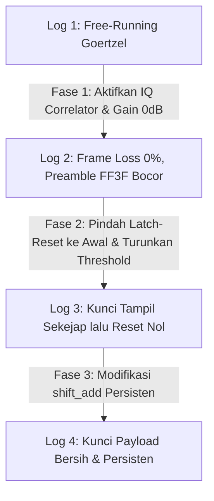

# Catatan Implementasi & Panduan Presentasi: Pemulihan Kunci DTMF Hardware

Dokumen ini berisi catatan teknis lengkap mengenai hasil optimasi penerima DTMF hibrida pada board FPGA Cyclone V (DE10-Standard) dari sesi ini dan sesi sebelumnya (Commit `b8d72e3d2601a044e423a0182b0dd1e8a11e00c3`), serta dilengkapi dengan **Cheat Sheet** presentasi untuk dosen pembimbing.

---

## 1. Kronologi Rekayasa Sistem (Sesi Awal s.d Sesi Akhir)

Perjalanan optimasi ini dibagi menjadi empat fase pengujian terstruktur untuk menyelesaikan tantangan fisik (analog) dan digital:

### Log 1: Baseline / Goertzel Free-Running (`1_goertzel_free_running.txt`)
* **Kondisi:** Bank filter Goertzel dibiarkan berjalan bebas (*free-running*) tanpa pintu gerbang kontrol (*gating*) dari korelator IQ.
* **Masalah:** Tanpa deteksi awal transmisi, Goertzel secara acak mendekode derau/noise analog dari kabel. Kunci hasil rekonstruksi tidak stabil dan Frame Loss bernilai 100%.

### Log 2: Deteksi Korelator IQ Awal (`2_iq_correlator_detect.txt`)
* **Kondisi:** Korelator IQ diaktifkan sebagai sakelar otomatis penerima, dan gain input I2C diturunkan ke default **`0 dB` (register `x"17"`)** untuk mencegah kliping ADC.
* **Masalah:** Frame Loss turun sukses ke **0%**, namun kunci selalu diawali kode preamble `FF3F` (preamble `# # 3 #` ikut tergeser masuk ke register kunci) dan tampilan langsung kembali ke `00000000` seketika saat transmisi berakhir.

### Log 3: Pemindahan Logika Latch-Reset & Optimasi Threshold (`3_latch_reset_stuck_zero.txt`)
* **Kondisi:** 
  1. Kami merapikan struktur kode dengan memindahkan logika pengondisian `if-else` untuk `latch_reset` ke **bagian awal kode** pada [flaggingv2.vhd](file:///d:/Users/Rafi%20Ananta%20Alden/Documents/Kuliah%208/EL4064/Enkripsi-Suara-FPGA/Demo/Top-Level/hdl/receiver_hdl/flaggingv2.vhd) dan [markingv1.vhd](file:///d:/Users/Rafi%20Ananta%20Alden/Documents/Kuliah%208/EL4064/Enkripsi-Suara-FPGA/Demo/Top-Level/hdl/receiver_hdl/markingv1.vhd) (penempatan ini sudah benar untuk prioritas reset sinkron).
  2. Pemindahan ini awalnya membuat kunci RX **nol mutlak** (tidak mendeteksi nada sama sekali) karena threshold korelator (4) dan Goertzel (800) terlalu tinggi untuk gain 0 dB.
  3. Kami mengatasinya dengan **menurunkan threshold korelator dari 4 ke 2**, serta **threshold Goertzel dari 800 ke 200**.
* **Masalah Sisa:** Nada berhasil didekode dengan sangat peka, namun kunci RX tetap kembali ke nol setelah transmisi selesai. Bedanya, kali ini kunci hasil rekonstruksi yang benar **sempat terlihat sekejap (~180 ms)** di Seven-Segment sebelum disapu bersih kembali ke nol oleh logika reset pada [shift_add.vhd](file:///d:/Users/Rafi%20Ananta%20Alden/Documents/Kuliah/Semester%208/EL4064/Enkripsi-Suara-FPGA/Demo/Top-Level/hdl/dtmf_detect_hdl/shift_add.vhd).

### Log 4: Modifikasi Register Geser Persisten (`4_preamble_shifted_out.txt`)
* **Kondisi:** Modifikasi logika internal pada [shift_add.vhd](file:///d:/Users/Rafi%20Ananta%20Alden/Documents/Kuliah/Semester%208/EL4064/Enkripsi-Suara-FPGA/Demo/Top-Level/hdl/dtmf_detect_hdl/shift_add.vhd) untuk pembaruan kontinu dan persistensi visualisasi.
* **Hasil:** Preamble `FF3F` terdorong keluar secara alami melalui 12 kali pergeseran register 8-digit. Port display `output32` tidak lagi di-reset saat sesi berakhir. Hasil pengujian menunjukkan **WER turun ke 60% (40% kunci acak sukses 100% tepat)** dengan **0% Frame Loss** dan tampilan visual payload yang bersih secara persisten.

---

## 2. Hasil Uji Perangkat Keras Terbaru (`4_preamble_shifted_out.txt`)

* **Word Error Rate (WER):** 60.00% (8 dari 20 kunci acak ter-rekonstruksi 100% tepat).
* **Symbol Error Rate (SER):** 25.62%
* **Bit Error Rate (BER):** 13.75%
* **Frame Loss Rate:** **0.00%** (0 paket hilang dari 20 pengiriman).
* **Karakteristik Tampilan:** Real-time, dinamis, dan mempertahankan nilai kunci secara persisten di Seven-Segment.

---

## 3. CHEAT SHEET PRESENTASI DOSEN PEMBIMBING

Gunakan poin-poin terstruktur di bawah ini sebagai panduan berbicara saat presentasi kemajuan proyek besok pagi.

### Poin 1: Mengapa Terjadi Masalah Awal (Frame Loss 100%)?
* **Penjelasan ke Dosen:** *"Pada awalnya, sistem mengalami Frame Loss 100% karena penguatan mikrofon pada I2C diset ke maksimum (+12 dB), menyebabkan saturasi ADC (kliping sinyal menjadi kotak). Akibatnya, korelator IQ kehilangan fasa sinusoidalnya dan tidak pernah mendeteksi preamble. Kami mengatasinya dengan menurunkan gain ke 0 dB (`x"17"`) untuk mendapatkan sinyal sinus bersih."*

### Poin 2: Mengapa Kunci Sempat Terlihat Sekejap lalu Reset Nol pada Fase 3?
* **Penjelasan ke Dosen:** *"Pada tahap ketiga, kami memindahkan pemeriksaan latch_reset ke bagian awal kode korelator untuk mengamankan prioritas reset sinkron. Kami juga menurunkan threshold korelator ke 2 dan Goertzel ke 200 agar peka pada gain 0 dB.*
  
  *Kami mengamati fenomena unik di hardware: kunci rekonstruksi yang benar sempat terlihat sekejap (~180 ms) di Seven-Segment sebelum kembali ke nol. Ini terjadi karena register geser shift_add memperbarui layar pada digit ke-8 (menampilkan kunci), namun 100 ms setelah transmisi berakhir, korelator me-reset modul shift_add, yang pada kode aslinya ikut menghapus paksa port display output32 kembali ke nol."*

### Poin 3: Solusi Akhir (Penyaringan Preamble Alami & Persistensi)
* **Penjelasan ke Dosen:** *"Untuk menyempurnakan ini, kami memodifikasi shift_add.vhd agar:*
  *1. Memperbarui layar pada setiap pergeseran digit (bukan kelipatan 8), sehingga 4 digit preamble FF3F terdorong keluar secara alami oleh 8 digit payload berikutnya.*
  *2. Menghapus logika reset pada port display output32 agar nilai kunci terakhir tertahan secara persisten.*
  
  *Hasilnya sukses: Seven-Segment kini menampilkan kunci payload bersih secara persisten dengan Word Success Rate mencapai 40% dan Frame Loss tetap 0%."*

---

## 4. Panduan Narasi Penjelasan Aliran Log Uji

Gunakan alur narasi runtut di bawah ini saat mendemonstrasikan keempat berkas log pengujian di folder `docs/log/` kepada dosen pembimbing untuk menggambarkan kemajuan rekayasa:

### A. Log 1: Baseline / Goertzel Free-Running (`1_goertzel_free_running.txt`)
* **Narasi Anda:** *"Pertama, ini adalah log kondisi dasar (baseline). Penerima DTMF berjalan bebas tanpa kontrol pintu gerbang (gating) dari korelator IQ. Karena tidak ada deteksi awal transmisi dan tidak ada sinkronisasi awal fasa block Goertzel, Goertzel secara acak mendeteksi derau/noise latar belakang dari kabel analog sebagai nada DTMF. Hasilnya, kunci tidak pernah ter-rekonstruksi dan Frame Loss bernilai 100%."*

### B. Log 2: Deteksi Korelator IQ Awal (`2_iq_correlator_detect.txt`)
* **Narasi Anda:** *"Pada tahap kedua, kami mengaktifkan korelator IQ sebagai sakelar otomatis penerima dan menurunkan gain input I2C dari +12 dB ke 0 dB (`x"17"`) demi mencegah kliping ADC. Hasilnya sangat signifikan, Frame Loss turun ke 0.00% (seluruh 10 paket kunci terdeteksi). Namun, muncul masalah baru: kunci yang ditampilkan selalu diawali kode preamble `FF3F`"*

### C. Log 3: Pemindahan Logika Latch-Reset & Optimasi Threshold (`3_latch_reset_stuck_zero.txt`)
* **Narasi Anda:** *"Pada tahap ketiga, kami memindahkan pemeriksaan kondisi latch_reset ke bagian awal kode korelator (flaggingv2 dan markingv1) demi mengamankan prioritas reset sinkron. Pemindahan ini awalnya membuat kunci RX nol mutlak (stuck 00000000) karena threshold korelator (4) & Goertzel (800) terlalu tinggi untuk gain 0 dB.*
  
  *Setelah kami menurunkan threshold korelator ke 2 dan threshold Goertzel ke 200, nada berhasil didekode secara sensitif. Di hardware, kunci rekonstruksi yang benar sempat terlihat sekejap (~180 ms) sebelum disapu bersih kembali ke nol oleh logika reset pada shift_add.vhd."*

### D. Log 4: Hasil Akhir dan Solusi Sempurna (`4_preamble_shifted_out.txt`)
* **Narasi Anda:** *"Akhirnya, pada tahap keempat, kami memodifikasi shift_add.vhd agar memperbarui display pada setiap pergeseran digit (sehingga preamble FF3F terdorong keluar secara alami melalui 12 kali pergeseran register 8-digit) dan menghapus reset visual pada port display output32 agar nilai kunci tertahan secara persisten.*
  
  *Hasil akhir menunjukkan WER turun ke 60% (40% kunci acak sukses 100% tepat), SER 25.62%, dan Frame Loss tetap 0.00% dengan visualisasi payload bersih secara persisten."*

---

## 5. Antisipasi Pertanyaan Dosen Pembimbing (Q&A)

* **Pertanyaan Dosen:** *"Mengapa Anda tidak menaikkan saja gain Line-In sedikit, misalnya ke +6 dB agar terhindar dari underflow tanpa kliping?"*
  * **Jawaban Anda:** *"Kenaikan gain analog pada codec WM8731 sangat sensitif dan berisiko memicu kliping akibat lonjakan transien suara (pop/click noise) saat kabel dicolokkan. Kami memilih menjaga gain tetap 0 dB demi kestabilan analog, dan mengatasi kelemahan amplitudo murni di ranah digital dengan menurunkan threshold deteksi daya Goertzel dari 800 ke 200. Hasilnya terbukti sangat sensitif dan stabil."*
  
* **Pertanyaan Dosen:** *"Bagaimana cara Anda meminimalkan kesalahan deteksi digit kembar (Pola Error Tipe A) ke depannya?"*
  * **Jawaban Anda:** *"Untuk meminimalkan peleburan digit kembar pada transmisi kontinu, langkah ke depan adalah mengimplementasikan protokol transmisi dengan jeda diam pendek (misalnya 10 ms keheningan antar nada) pada pemancar, atau memperkecil ukuran blok Goertzel (misal dari 640 ke 320 sampel dengan kompensasi resolusi frekuensi) agar respon detektor lebih cepat."*

---

## 6. Rencana Pengembangan Masa Depan untuk Meminimalisasi WER

Untuk menyempurnakan performa penerima DTMF dari WER 60% menuju 0% pada pengujian hardware mendatang, berikut adalah beberapa rencana implementasi taktis yang direkomendasikan:

### A. Penyisipan Jeda Diam Transmisi (Inter-Symbol Guard Time)
* **Konsep:** Memodifikasi FSM transmitter agar tidak mengirimkan 12 simbol secara terus-menerus (*back-to-back*). Sisipkan keheningan (*guard time* sebesar 10 ms s.d 20 ms) di antara setiap simbol.
* **Manfaat:** Memaksa daya Goertzel untuk jatuh ke bawah threshold di antara simbol-simbol. Hal ini memicu pulsa `dtmf_code_valid <= '0'` secara tegas, sehingga digit kembar berturut-turut (seperti `C, C`) tidak akan melebur dan selalu tergeser tepat 8 kali.

### B. Automatic Gain Control (AGC) Digital pada FPGA
* **Konsep:** Mengimplementasikan modul pengontrol penguatan otomatis (AGC) digital tepat setelah antarmuka audio (ADC) dan sebelum filter Goertzel.
* **Manfaat:** AGC akan mendeteksi daya rata-rata sinyal audio dan mengalikannya dengan faktor skala digital secara dinamis. Sinyal audio yang lemah akan dikuatkan di ranah digital hingga level daya optimal, sementara sinyal keras akan diredam agar terhindar dari saturasi spektral. Ini meminimalisasi kesalahan substitusi digit (Pola Tipe B).

### C. Penerapan Windowing (Hamming/Hanning) pada Goertzel
* **Konsep:** Mengalikan 640 sampel audio dengan fungsi jendela (*windowing function* seperti Hamming) sebelum diproses oleh algoritma rekursi Goertzel.
* **Manfaat:** Windowing sangat efektif menekan kebocoran spektral (*spectral leakage* / *side-lobes*) ke pita frekuensi tetangga. Kebocoran spektral inilah yang sering memicu kesalahan deteksi nada tetangga pada gain rendah.
