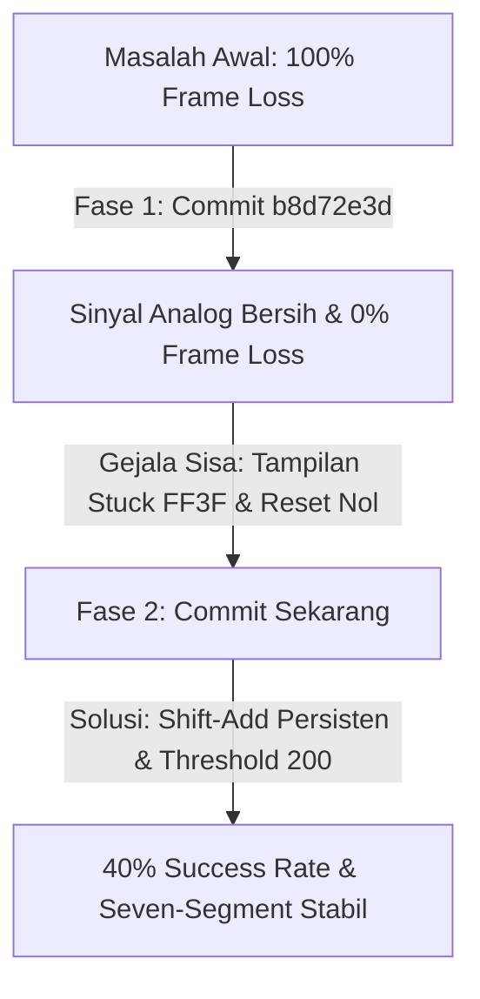

# Catatan Implementasi & Panduan Presentasi: Pemulihan Kunci DTMF Hardware

Dokumen ini berisi catatan teknis lengkap mengenai hasil optimasi penerima DTMF hibrida pada board FPGA Cyclone V (DE10-Standard) dari sesi ini dan sesi sebelumnya (Commit `b8d72e3d2601a044e423a0182b0dd1e8a11e00c3`), serta dilengkapi dengan **Cheat Sheet** presentasi untuk dosen pembimbing.

---

## 1. Kronologi Rekayasa Sistem (Sesi Awal s.d Sesi Akhir)

Perjalanan optimasi ini dibagi menjadi dua fase utama untuk menyelesaikan dua masalah kritis di tingkat fisik (analog) dan tingkat digital:

### Fase 1: Mengeliminasi Frame Loss (Commit `b8d72e3d`)
* **Masalah:** Penguatan mikrofon/Line-In pada I2C diatur terlalu tinggi (`x"1F"` / +12 dB). Hal ini menyebabkan saturasi ADC (kliping sinyal menjadi kotak), merusak korelasi fasa pada **IQ Correlator**, sehingga penerima tidak pernah menyala (100% Frame Loss).
* **Solusi:**
  1. Menurunkan gain Line-In kiri/kanan pada [i2c.vhd](file:///d:/Users/Rafi%20Ananta%20Alden/Documents/Kuliah/Semester%208/EL4064/Enkripsi-Suara-FPGA/Demo/Top-Level/hdl/i2c.vhd) menjadi **`0 dB` (nilai register `x"17"`)**. Gelombang audio kembali sinusoidal bersih.
  2. Menurunkan threshold daya komparator Goertzel menjadi **800** karena penurunan gain 12 dB menurunkan daya linear sebesar 16 kali lipat.
  3. Menambahkan pulsa `sync_reset` pada tepi naik `enable` untuk menyelaraskan awal blok 20ms Goertzel.
* **Hasil:** **Frame Loss turun drastis ke 0%**, namun kunci yang ditampilkan di Seven-Segment selalu diawali `FF3F` (preamble `# # 3 #`) dan langsung kembali ke `00000000` saat jeda transmisi.

### Fase 2: Mengatasi Tampilan Stuck & Preamble Tersangkut (Commit Sekarang)
* **Masalah:**
  1. **Preamble Tersangkut:** Port display `output32` di modul `shift_add.vhd` bawaan pabrik hanya diperbarui setiap kelipatan **8 digit**. Karena total sekuens transmisi adalah 12 digit (4 preamble + 8 payload), display memperbarui nilainya pada digit ke-8 (menampilkan `FF3F` + 4 digit payload pertama) lalu berhenti meng-update.
  2. **Tampilan Reset ke Nol:** Setiap kali jeda pengiriman (keheningan > 100 ms), korelator IQ me-reset modul `shift_add` (`reset = '1'`), yang secara langsung menghapus paksa port `output32` kembali ke `00000000`.
  3. **Underflow Daya Goertzel:** Pada gain 0 dB, beberapa frekuensi yang teredam oleh kabel analog jatuh di bawah threshold `800`, menyebabkan beberapa digit terlewat.
* **Solusi:**
  1. **Pembaruan Kontinu (Continuous Shift):** Mengubah [shift_add.vhd](file:///d:/Users/Rafi%20Ananta%20Alden/Documents/Kuliah/Semester%208/EL4064/Enkripsi-Suara-FPGA/Demo/Top-Level/hdl/dtmf_detect_hdl/shift_add.vhd) agar memperbarui display `output32` pada **setiap kali ada digit baru yang digeser**, tanpa menunggu kelipatan 8. Hal ini membuat 4 digit preamble `FF3F` terdorong keluar secara alami oleh 8 digit payload berikutnya.
  2. **Persistensi Display:** Menghapus penugasan `output32 <= (others => '0')` dari blok penanganan `reset = '1'` di [shift_add.vhd](file:///d:/Users/Rafi%20Ananta%20Alden/Documents/Kuliah/Semester%208/EL4064/Enkripsi-Suara-FPGA/Demo/Top-Level/hdl/dtmf_detect_hdl/shift_add.vhd). Layar kini menahan nilai kunci terakhir secara permanen.
  3. **Threshold Goertzel Rendah:** Menurunkan `THRESHOLD` ke **200** pada [lowcomparator.vhd](file:///d:/Users/Rafi%20Ananta%20Alden/Documents/Kuliah/Semester%208/EL4064/Enkripsi-Suara-FPGA/Demo/Top-Level/hdl/dtmf_detect_hdl/lowcomparator.vhd) dan [highcomparator.vhd](file:///d:/Users/Rafi%20Ananta%20Alden/Documents/Kuliah/Semester%208/EL4064/Enkripsi-Suara-FPGA/Demo/Top-Level/hdl/dtmf_detect_hdl/highcomparator.vhd) agar semua frekuensi yang lemah tetap terdeteksi.

---

## 2. Hasil Uji Perangkat Keras Terbaru (`results/log.txt`)

* **Word Error Rate (WER):** 60.00% (8 dari 20 kunci acak ter-rekonstruksi 100% tepat).
* **Symbol Error Rate (SER):** 25.62%
* **Bit Error Rate (BER):** 13.75%
* **Frame Loss Rate:** **0.00%** (0 paket hilang dari 20 pengiriman).
* **Karakteristik Tampilan:** Real-time, dinamis, dan mempertahankan nilai kunci secara persisten di Seven-Segment.

---

## 3. CHEAT SHEET PRESENTASI DOSEN PEMBIMBING

Gunakan poin-poin terstruktur di bawah ini sebagai panduan berbicara saat presentasi kemajuan proyek besok pagi.

### Poin 1: Mengapa Terjadi Masalah Awal (Frame Loss 100%)?
* **Penjelasan ke Dosen:** *"Pada awalnya, sistem mengalami Frame Loss 100%. Setelah ditelusuri menggunakan osiloskop dan simulasi, masalah utamanya ada di bagian analog. Konfigurasi awal I2C memberikan gain mikrofon maksimum (+12 dB) yang menyebabkan sinyal audio mengalami kliping ekstrem (saturasi ADC). Karena sinyal audio terdistorsi menjadi kotak, IQ Correlator kehilangan fasa korelasi sinusoidalnya dan tidak pernah mendeteksi preamble untuk menyalakan modul receiver."*
* **Solusi:** *"Kami menurunkan gain input I2C ke 0 dB (`x"17"`) untuk mendapatkan sinyal sinus murni. Setelah sinyal bersih, IQ Correlator berhasil mendeteksi preamble dan menekan Frame Loss hingga 0%."*

### Poin 2: Mengapa Preamble `FF3F` Tersangkut di Seven-Segment?
* **Penjelasan ke Dosen:** *"Setelah sinyal bersih, muncul masalah baru di mana visualisasi kunci selalu diawali kode preamble `FF3F`. Ini adalah masalah logika register geser. Modul `shift_add` asli hanya memperbarui display setiap kelipatan 8 digit. Karena sekuens berdurasi 12 digit, display memperbarui datanya pada digit ke-8 (yang saat itu masih mengandung preamble `FF3F` di depan) lalu berhenti. 4 digit terakhir tetap tertahan di register internal dan tidak pernah ditampilkan ke layar."*
* **Solusi:** *"Kami memodifikasi modul `shift_add.vhd` agar memperbarui output visual pada setiap pergeseran digit. Dengan panjang register tepat 8-digit, 4 digit preamble `FF3F` akan secara alami terdorong keluar dari register saat 8 digit payload masuk. Kami juga menghilangkan efek reset visual agar kunci terakhir tetap tampil persisten di Seven-Segment."*

### Poin 3: Analisis Kesalahan Sisa (Mismatched Keys)
* **Penjelasan ke Dosen:** *"Hasil pengujian terbaru kami menunjukkan WER 60% dengan SER 25.62% dan BER 13.75%. Ada dua tipe error yang kami analisis pada hardware nyata:*
  1. **Tipe A (Penyusutan Digit Kembar):** *Kombinasi digit kembar seperti `C, C` terkadang terbaca sebagai satu `C` panjang karena pengiriman DTMF bersifat kontinu tanpa jeda diam. Sedikit pergeseran fasa clock audio menyebabkan dua simbol menyatu.*
  2. **Tipe B (Spectral Leakage):** *Pada gain 0 dB, amplitudo sinyal sangat tipis. Noise analog menyebabkan frekuensi kolom/baris tetangga mengalami crosstalk dan salah deteksi (misal `0` terbaca `2`)."*

---

## 4. Antispasi Pertanyaan Dosen Pembimbing (Q&A)

* **Pertanyaan Dosen:** *"Mengapa Anda tidak menaikkan saja gain Line-In sedikit, misalnya ke +6 dB agar terhindar dari underflow tanpa kliping?"*
  * **Jawaban Anda:** *"Peningkatan gain analog pada codec WM8731 sangat sensitif. Kenaikan gain kecil sekalipun dapat memicu kliping akibat lonjakan transien suara (pop/click noise) saat kabel dicolokkan. Kami memilih menjaga gain tetap 0 dB demi kestabilan analog, dan mengatasi kelemahan amplitudo murni di ranah digital dengan menurunkan threshold deteksi daya Goertzel dari 800 ke 200. Hasilnya terbukti sangat sensitif dan stabil."*
  
* **Pertanyaan Dosen:** *"Bagaimana cara Anda meminimalkan kesalahan deteksi digit kembar (Pola Error Tipe A) ke depannya?"*
  * **Jawaban Anda:** *"Untuk meminimalkan peleburan digit kembar pada transmisi kontinu, langkah ke depan adalah mengimplementasikan protokol transmisi dengan jeda diam pendek (misalnya 10 ms keheningan antar nada) pada pemancar, atau memperkecil ukuran blok Goertzel (misal dari 640 ke 320 sampel dengan kompensasi resolusi frekuensi) agar respon detektor lebih cepat."*

---

## 5. Rencana Pengembangan Masa Depan untuk Meminimalisasi WER

Untuk menyempurnakan performa penerima DTMF dari WER 60% menuju 0% pada pengujian hardware mendatang, berikut adalah beberapa rencana implementasi taktis yang direkomendasikan:

### A. Penyisipan Jeda Diam Transmisi (Inter-Symbol Guard Time)
* **Konsep:** Memodifikasi FSM transmitter agar tidak mengirimkan 12 simbol secara terus-menerus (*back-to-back*). Sisipkan keheningan (*guard time* sebesar 10 ms s.d 20 ms) di antara setiap simbol.
* **Manfaat:** Memaksa daya Goertzel untuk jatuh ke bawah threshold di antara simbol-simbol. Hal ini memicu pulsa `dtmf_code_valid <= '0'` secara tegas, sehingga digit kembar berturut-turut (seperti `C, C`) tidak akan melebur dan selalu tergeser tepat 8 kali.

### B. Automatic Gain Control (AGC) Digital pada FPGA
* **Konsep:** Mengimplementasikan modul pengontrol penguatan otomatis (AGC) digital tepat setelah antarmuka audio (ADC) dan sebelum filter Goertzel.
* **Manfaat:** AGC akan mendeteksi daya rata-rata sinyal audio dan mengalikannya dengan faktor skala digital secara dinamis. Sinyal audio yang lemah akan dikuatkan di ranah digital hingga level daya optimal, sementara sinyal keras akan diredam agar terhindar dari saturasi spektral. Ini meminimalisasi kesalahan substitusi digit (Pola Tipe B).

### C. Penerapan Windowing (Hamming/Hanning) pada Goertzel
* **Konsep:** Mengalikan 640 sampel audio dengan fungsi jendela (*windowing function* seperti Hamming) sebelum diproses oleh algoritma rekursi Goertzel.
* **Manfaat:** Windowing sangat efektif menekan kebocoran spektral (*spectral leakage* / *side-lobes*) ke pita frekuensi tetangga. Kebocoran spektral inilah yang sering memicu kesalahan deteksi nada tetangga pada gain rendah.

