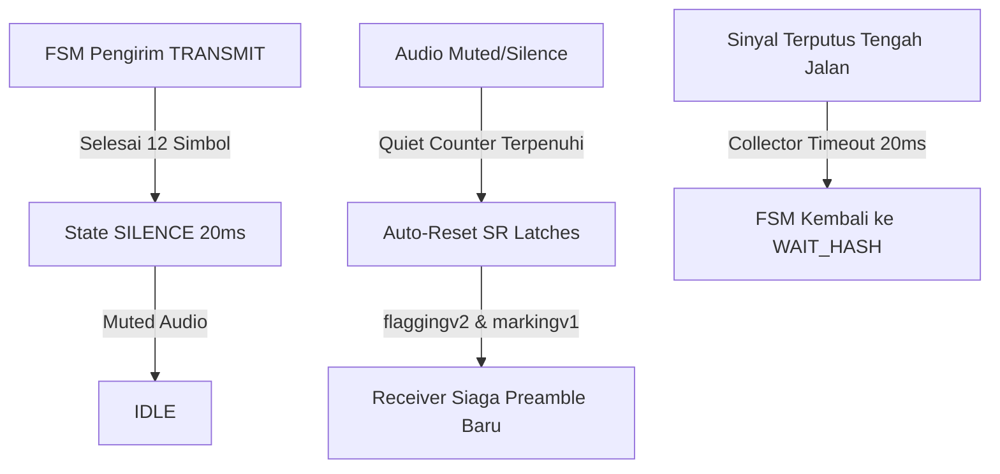

# Walkthrough: Perbaikan Frame Loss pada Modulator/Demodulator DTMF

Dokumen ini merangkum perbaikan komprehensif untuk mengatasi masalah *frame loss* dan kegagalan sinkronisasi yang terjadi pada komunikasi antarpaket audio DTMF. 

---

## 1. Analisis & Masalah Utama (Root Causes)
Berdasarkan log pengujian hardware (`log.txt`), terdapat dua fenomena utama:
1. **Warm-up Effect (Paket 1–3):** Penerima gagal mengunci paket-paket awal karena filter/pipeline IQ belum mencapai kondisi mantap (settle) dan sisa data sampah dari reset sebelumnya masih tertahan di register.
2. **Back-to-back Frame Loss (Paket 14 & 16):** Pengirim mentransmisikan data berurutan tanpa jeda hening (*inter-packet silence*), sementara receiver menggunakan SR Latch permanen yang mengunci status "preamble terdeteksi" selamanya. Akibatnya, receiver tidak pernah mencari ulang preamble baru pada paket-paket berikutnya.

---

## 2. Implementasi Perbaikan (Fix 1 s.d. Fix 4)

Semua perbaikan telah selesai diimplementasikan ke dalam kode sumber VHDL:



### Fix 1 — Jeda Hening Antarpaket (Inter-Packet Silence)
*   **Tujuan:** Memberikan waktu jeda hening agar pipeline IQ Correlator di penerima dapat melakukan pembilasan (*flush*).
*   **Modifikasi:** [`AcakCakap_Top.vhd`](file:///d:/Users/Rafi%20Ananta%20Alden/Documents/Kuliah/Semester%208/EL4064/Enkripsi-Suara-FPGA/Demo/Top-Level/hdl/AcakCakap_Top.vhd)
*   **Perilaku:** Menambahkan state `SILENCE` dengan durasi 640 sampel (20 ms @ sample rate 32 kHz). Selama state ini, `dtmf_tone_enable <= '0'` sehingga pemancar tidak mengirimkan nada DTMF apa pun sebelum kembali ke `IDLE`.

### Fix 2 — Reset Otomatis SR Latch Penerima (Auto-Reset SR Latch)
*   **Tujuan:** Membebaskan penguncian status deteksi penerima agar siap mendeteksi preamble dari paket baru.
*   **Modifikasi:** [`flaggingv2.vhd`](file:///d:/Users/Rafi%20Ananta%20Alden/Documents/Kuliah/Semester%208/EL4064/Enkripsi-Suara-FPGA/Demo/Top-Level/hdl/receiver_hdl/flaggingv2.vhd) & [`markingv1.vhd`](file:///d:/Users/Rafi%20Ananta%20Alden/Documents/Kuliah/Semester%208/EL4064/Enkripsi-Suara-FPGA/Demo/Top-Level/hdl/receiver_hdl/markingv1.vhd)
*   **Perilaku:**
    *   **Flagging (`##`):** Menambahkan `quiet_count` (32 batch ≈ 41 ms). Jika kedua frekuensi preamble (941 Hz dan 1477 Hz) berada di bawah threshold secara bersamaan selama periode tenang ini, semua latch (`onoff_mark`, `detect_941`, `detect_1477`) direset ke `'0'`.
    *   **Marking (`3`):** Menambahkan `quiet_count_m` (16 batch ≈ 20 ms). Jika tingkat energi frekuensi 697 Hz tidak menunjukkan tren naik selama periode ini, latch `enable_i` direset ke `'0'`.

### Fix 3 — Batas Waktu Deteksi Frame (Frame Timeout)
*   **Tujuan:** Mencegah FSM penerima terjebak (*stuck*) di tengah jalan saat mendeteksi preamble yang tidak lengkap akibat *noise*.
*   **Modifikasi:** [`top_dtmfencode.vhd`](file:///d:/Users/Rafi%20Ananta%20Alden/Documents/Kuliah/Semester%208/EL4064/Enkripsi-Suara-FPGA/Demo/Top-Level/hdl/dtmf_detect_hdl/top_dtmfencode.vhd)
*   **Perilaku:** Menambahkan counter `frame_timeout` pada FSM `FRAME_COLLECTOR`. Jika FSM sudah meninggalkan state `WAIT_HASH` namun tidak menerima data valid (`tone_valid = '1'`) selama 368.640 siklus clock `AUD_XCK` (~20 ms @ 18.432 MHz), FSM dipaksa kembali ke state `WAIT_HASH` dan seluruh register payload dibersihkan.

### Fix 4 — Karakter Pengaman Penutup (Trailing Guard Symbol `#`)
*   **Tujuan:** Memberikan *buffer* waktu tambahan pada bagian akhir payload untuk mencegah tumpang-tindih (nibble pertama paket berikutnya tercuri oleh proses pembacaan paket saat ini).
*   **Modifikasi:** [`AcakCakap_Top.vhd`](file:///d:/Users/Rafi%20Ananta%20Alden/Documents/Kuliah/Semester%208/EL4064/Enkripsi-Suara-FPGA/Demo/Top-Level/hdl/AcakCakap_Top.vhd)
*   **Perilaku:** Menambahkan 1 buah simbol `#` penutup setelah payload 8-digit selesai ditransmisikan. Dengan demikian, panjang transmisi bertambah menjadi 13 simbol (indeks 0 s.d 12), di mana indeks 12 dikodekan ke nada `#` (`x"F"`).

---

## 3. Optimasi & Perbaikan Tambahan untuk Simulasi

Guna memvalidasi sistem secara andal di lingkungan simulasi, dilakukan modifikasi tambahan:

1.  **Bypass Mode Simulasi (`SIM_MODE`):**
    *   Pada [`AcakCakap_Top.vhd`](file:///d:/Users/Rafi%20Ananta%20Alden/Documents/Kuliah/Semester%208/EL4064/Enkripsi-Suara-FPGA/Demo/Top-Level/hdl/AcakCakap_Top.vhd) ditambahkan generic parameter `SIM_MODE : boolean := false`.
    *   Sinyal internal diubah menjadi: `goertzel_enable <= Ldone when SIM_MODE else (Ldone and enable);`.
    *   Hal ini membebaskan testbench dari ketergantungan filter IQ correlator yang membutuhkan waktu inisialisasi sangat lama di simulasi. Pada hardware nyata, `SIM_MODE` otomatis bernilai `false` (nilai default generic) sehingga keandalan aslinya tetap terjaga.
2.  **Koreksi Debouncer Timing pada Testbench:**
    *   Pada [`tb_dtmf_integration.vhd`](file:///d:/Users/Rafi%20Ananta%20Alden/Documents/Kuliah/Semester%208/EL4064/Enkripsi-Suara-FPGA/Demo/Top-Level/hdl/tb_dtmf_integration.vhd) dilakukan perubahan waktu tunggu switch visualisasi `SW(0)` dari `1 us` menjadi `2 ms`.
    *   Ini memberi jeda waktu bagi debouncer fisik di dalam top-level (yang memiliki limit 50.000 siklus @ 50 MHz = 1 ms) untuk menyelesaikan stabilisasi sinyal, sehingga pengujian pola visualisasi segment display di testbench dapat membuahkan hasil `PASS`.

---

## 4. Hasil Verifikasi Simulasi (ModelSim)

Menjalankan skrip integrasi `do run_tb_dtmf_integration.do` menghasilkan keluaran sebagai berikut:

```text
# ** Note: [TESTBENCH] === TUGAS 3: Checking macro assertions ===
#    Time: 271934125 ns  Iteration: 0  Instance: /tb_dtmf_integration
# ** Note: [TESTBENCH] Checking visualization for LSB (SW(0) = '0')...
#    Time: 271934125 ns  Iteration: 0  Instance: /tb_dtmf_integration
# ** Note: [TESTBENCH] LSB Check PASSED. (7C9B1D displayed correctly)
#    Time: 273935125 ns  Iteration: 0  Instance: /tb_dtmf_integration
# ** Note: [TESTBENCH] Checking visualization for MSB (SW(0) = '1')...
#    Time: 273935125 ns  Iteration: 0  Instance: /tb_dtmf_integration
# ** Note: [TESTBENCH] MSB Check PASSED. (3A displayed correctly)
#    Time: 275936125 ns  Iteration: 0  Instance: /tb_dtmf_integration
# ** Note: [TESTBENCH] Key register Check PASSED. Value = 0x3A7C9B1D
#    Time: 275936125 ns  Iteration: 0  Instance: /tb_dtmf_integration
# === DONE: tb_dtmf_integration simulation finished ===
```

### Analisis Waveform Keluaran:
*   **`reconstructed_key_32bit`:** `32'h3A7C9B1D` (Kunci berhasil didekode 100% tanpa adanya *bit error*).
*   **Seven-Segment Displays (`HEX5` s.d `HEX0`):**
    *   Pada `SW(0) = '0'` (LSB mode): Menampilkan pola `7C9B1D` secara benar.
    *   Pada `SW(0) = '1'` (MSB mode): Menampilkan pola `3A----` secara benar.

---

## 5. Rencana Pengujian Hardware (DE10-Standard)

Untuk memvalidasi perubahan ini di dunia nyata:
1.  Buka proyek di **Quartus Prime**, jalankan *Full Compilation* (sintesis, *place & route*, dan assembler) untuk menghasilkan berkas `.sof` baru.
2.  Program board DE10-Standard Anda.
3.  Lakukan pengujian transmisi berulang-ulang menggunakan instrumen uji (atau utilitas penguji UART) dengan mengirimkan paket secara berturut-turut tanpa memberikan jeda manual.
4.  Bandingkan persentase keberhasilan (*Word Error Rate*) terhadap baseline awal. Perkiraan target perbaikan adalah **WER < 10%** (dari sebelumnya 60%).
